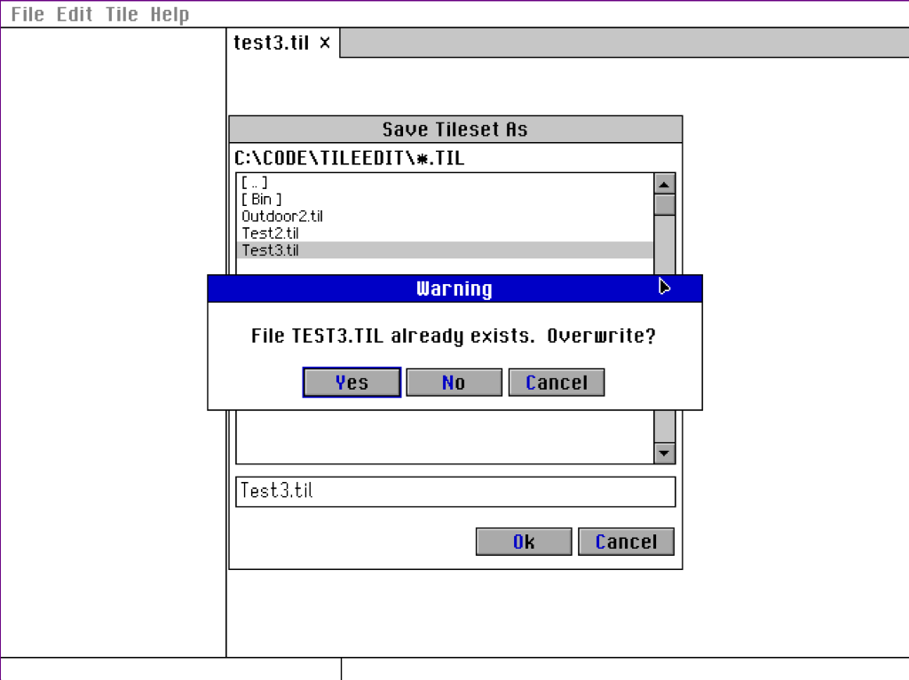
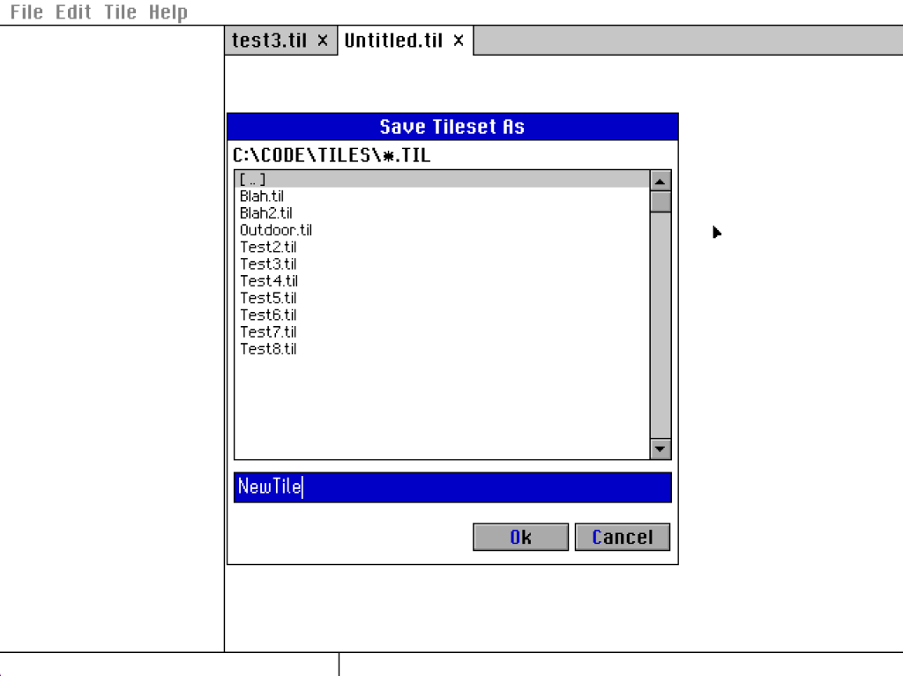
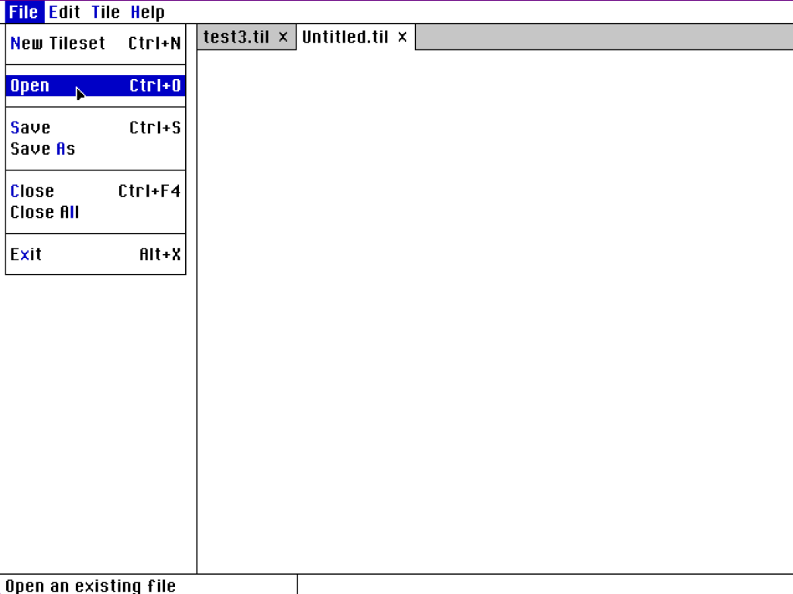
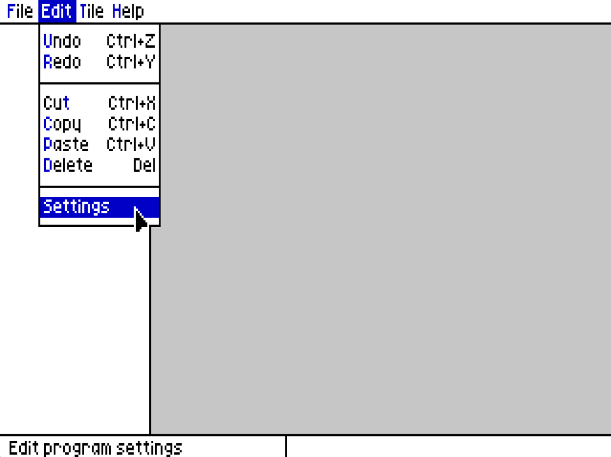
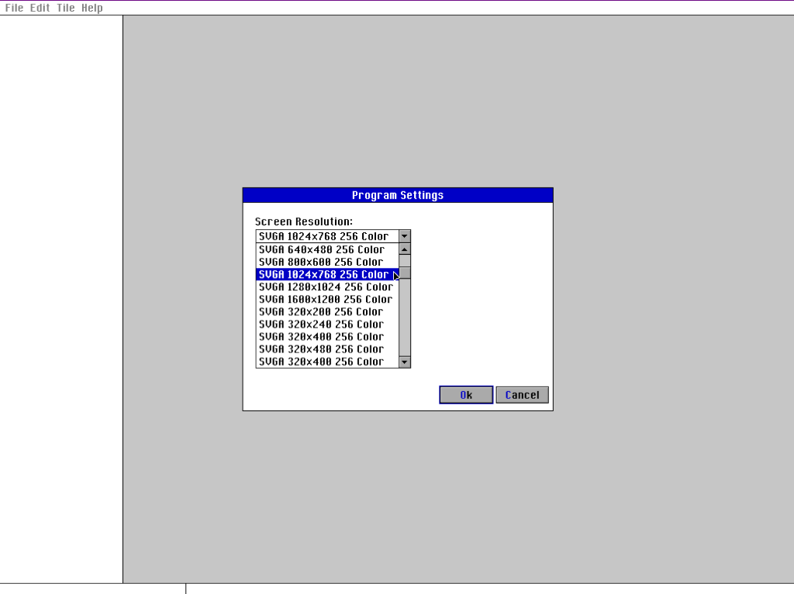

# Veridian
Veridian is an GUI library for MS-DOS written in Turbo Pascal 7 using the Alaveri Pascal Library (APL).  It supports VGA/SVGA 256, proportional fonts, windows, menus, buttons and other GUI controls (early version under development).

Veridian runs under MS-DOS in Real Mode, and can access XMS memory using the XMS 1-3 specification.  The TMemoryStream class from the APL allows data larger than 64k to be stored and swapped in and out of XMS as needed.  Below are some screenshots of early development of Veridian.  The program is an early version of the code from the TileEdit repository, and both of these projects are being developed together.  Note that these screenshots are not meant to demonstrate a fully functional program, but only some of the early capabilities of Veridian.

Veridian in SVGA 640x480x256 color:

  

Veridian in VGA 320x200x256 color:

 

Veridian in SVGA 1024x768x256 color:

